# Составление задания.
|№|Описание|Код|Персонаж|Поле|
|---|:---:|:---:|:---:|:---:|
|1|10 шагов вперед|||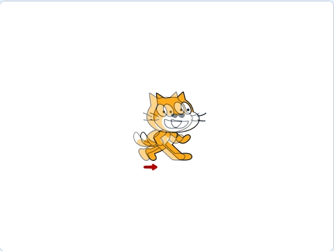|
|2|Повторять всегда,   10 шагов вперед|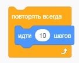||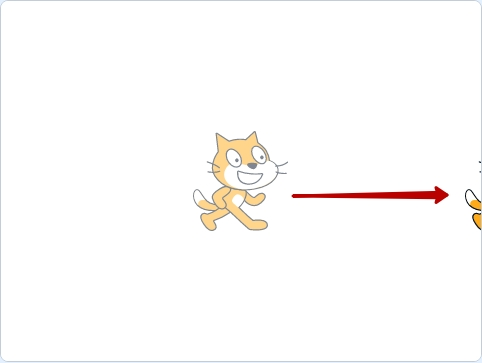|
|3|Повторять всегда,  10 шагов вперед,  если касается края, оттолкнуться|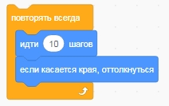||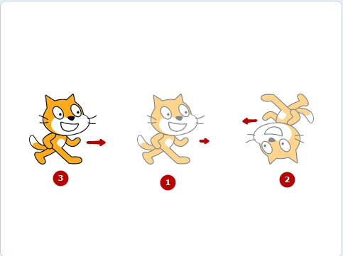|
|4|Повторять всегда,  10 шагов вперед,  если касается края, оттолкнуться,  Установить способ вращения влево-вправо|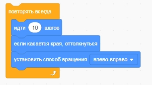||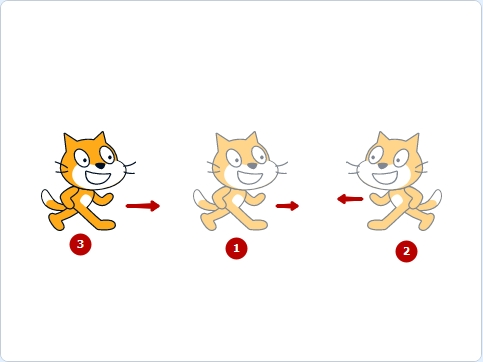|
|5|Повторять всегда,  10 шагов вперед,  если касается края, оттолкнуться,  Установить способ вращения влево-вправо Следующий костюм|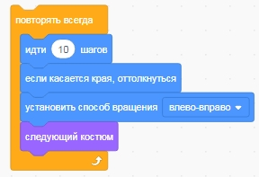||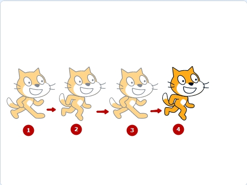|
|6|Повторять всегда,  10 шагов вперед,  если касается края, оттолкнуться,  Установить способ вращения влево-вправо Следующий костюм,   Ждать 0.1 сек|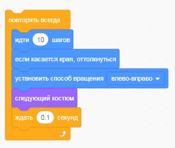|||
|6|Когда зеленый флажек нажат, Повторять всегда,  10 шагов вперед,  если касается края, оттолкнуться,  Установить способ вращения влево-вправо Следующий костюм,   Ждать 0.1 сек|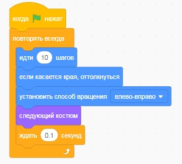||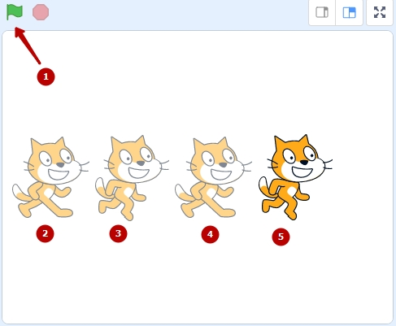|