# Программирование для детей
## Запуск среды Scratch онлайн

Первая задача - запустить программу.  
Для этого - необходимо зайти по адресу <a href = "https://scratch.mit.edu/">https://scratch.mit.edu/</a>. И нажать кнопку "Начать создавать".  
Перед вами рабочее поле среды программирования Scratch.
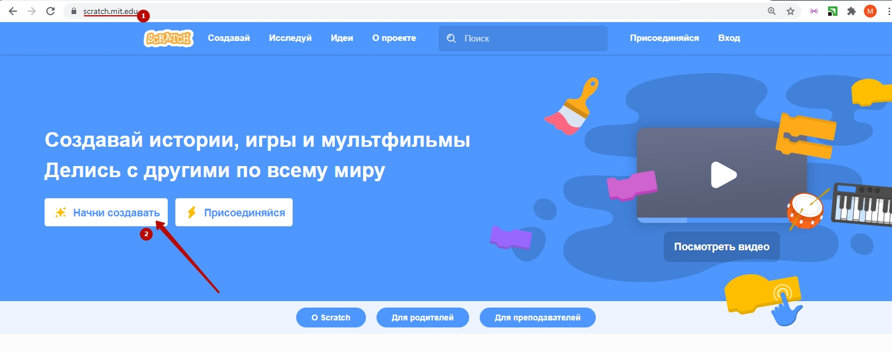  
## Основная задача среды программирования
Основная задача данной среды программирования - в интересной форме познакомить ребенка с работой с **программным кодом**, **графикой**, **звуками** (2).
Для этого есть команды в **блоке команд** (4), навигация по которым упрощается с помощью **меню команд** (3).
Программирование движений персонажей, которые находятся в **поле персонажа** (6) происходит благодаря переносом команд в **рабочее поле** (5), при этом есть возможность настраивать персонажей в **поле управления спрайтами** (7) и настраивать фоны в **поле управления сценами** (8).

## Описание полей
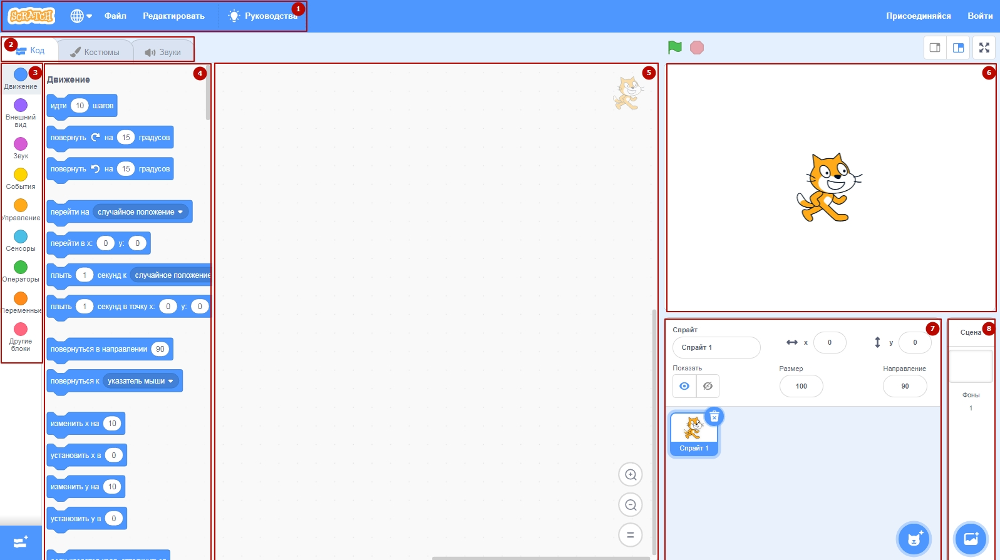  

1. Меню настроек (изменение языка, сохранение и загрузка файлов).   
2. Меню основных инструментов (код, костюмы, звуки).   
3. Меню команд (переключение типов команд).   
4. Блок команд для использования.   
5. Рабочее поле (поле для составление кодов).   
6. Поле персонажа.   
7. Поле управления спрайтам.   
8. Поле управления сценами.   

## Передвижение персонажа

Для того, чтобы запустить движение персонажа - достаточно сделать двойное нажатие на команду "идти 10 шагов"  
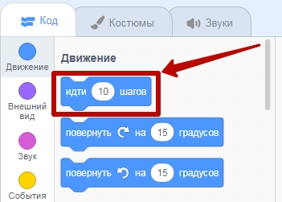  
И в результате этого персонаж переместится вперед на 10 шагов.  
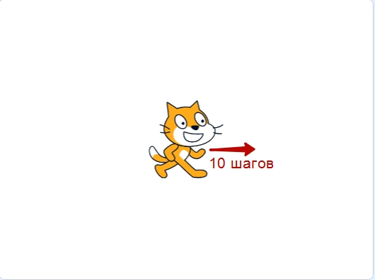  

**Задание:**
1. Прокликайте на блок "**Идти 10 шагов**" 27 раз (котик дойдет до края).  
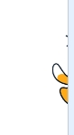  

## Возврат в исходное положение
Движение персонажа вперед - это знакомство с его перемещением.  
Для установки персонажа в исходное положение необходимо обновить страницу (нажать на клавиатуре кнопку **F5**). Или установить координату **x** в значение **0**.    
  
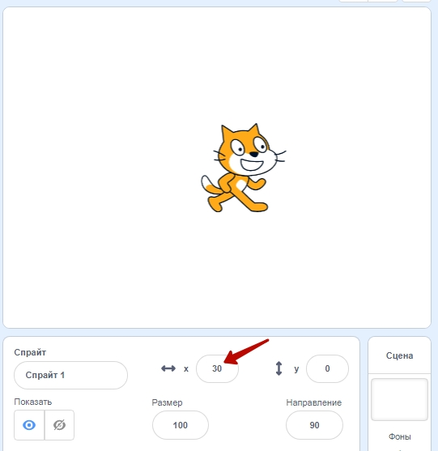  -->  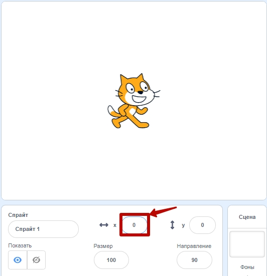  

## Бесконечное движение
### Запуск движения
Движение - это повторение команды "**Идти 10 шагов**" много-много раз. Для этого установим событие 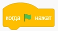, в пункте меню 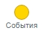. Команду "**Повторять всегда**" 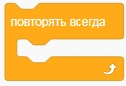 меню "**управление**" 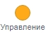. И в "желтый крокодил" "**Повторять всегда**" вставить команду "**Идти 10 шагов**" 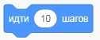 меню "**Движение**" 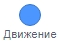.  
В результате сбора должна получиться следующая конструкция:  
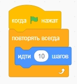  
Для ее запуска необходимо нажать зеленой флажок над полем персонажа.  
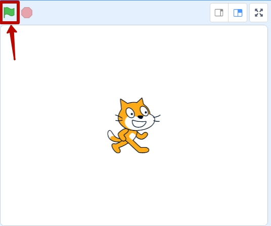  
В результате выполнение данного блока команд персонаж дойдет до края  
  
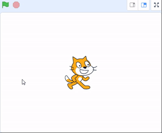  

### Отталкивание от края.
В меню движение пролистаем команды вниз.  
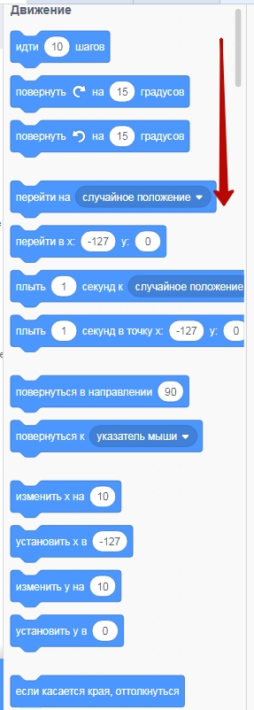  

В конце списка команд в пункте меню "**Движение**" возьмем команду "**Если оттолкнуться от края**" и вставим ее в цикл "**Повторять всегда**" после команды "**идти 10 шагов**"  
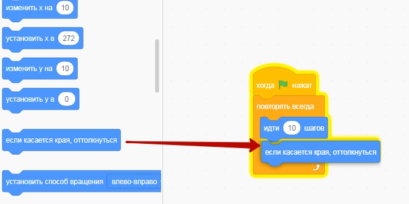  
в результате такого добавления наш персонаж будет отталкиваться от края, если его касается.  
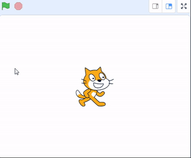  

### Запрет переворота.
Мы видим, что наш котик переворачивается вверх ногами при касании края. Для того, чтобы он разворачивался при касании края, а не переворачивался в общую программу добавим команду "**установить способ вращения влево-вправо**"  
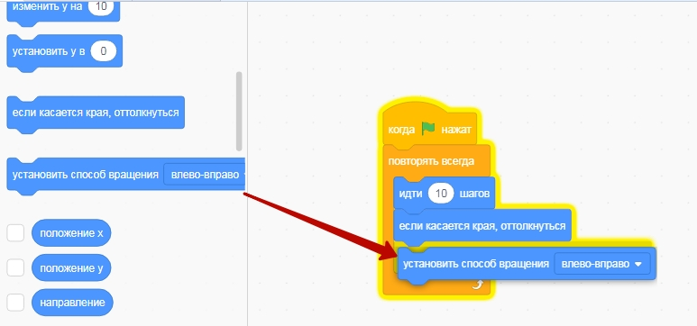  
В результате добавления данного элемента котик будет разворачиваться, при касании края (а не переворачиваться).  
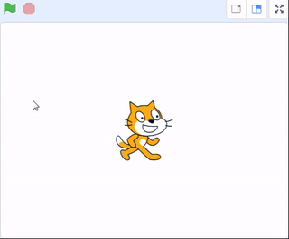  

### Смена костюма.
Добавим блок "**Новый костюм**" меню блоков "**Внешний вид**".  
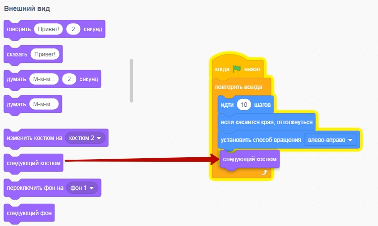  
Это "оживит" движение нашего котика.  
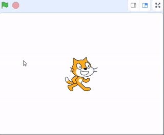  

### Добавление задержки
Наш котик двигается слишком быстро. Для того, чтобы снизить скорость движения котика - добавим команду "**ждать 1 секунд**" из пункта меню команд "**Управление**"
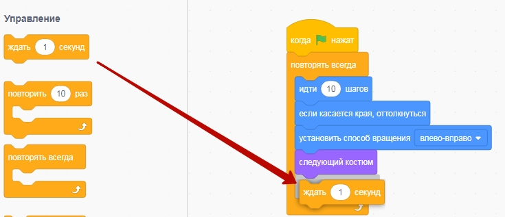  
Это снизит скорость движения котика.  
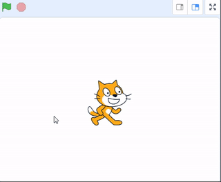  

### Уменьшение длительности задержки
Задержка в 1 секунду делает действия котика слишком медленной, поэтому сократим задержку до 0.1 секунды  
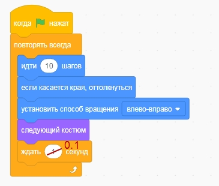  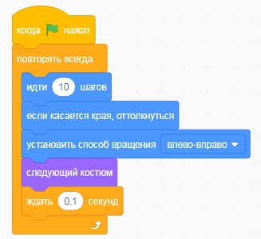   
В результате - будет более медленное движени котика.  
  

## Добавление и программирование нового персонажа.

29tYvoD1Heo

Мы научились "прогуливать" первого персонажа - котика. Добавим еще одного персонажа.  
Для этого в блоке управления персонажем добавим новый спрайт (персонаж).  
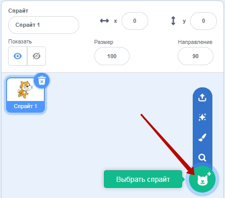  

В открывшемся окне выберем спрайт (персонаж) "**Bear-walking**" (гуляющий медведь).

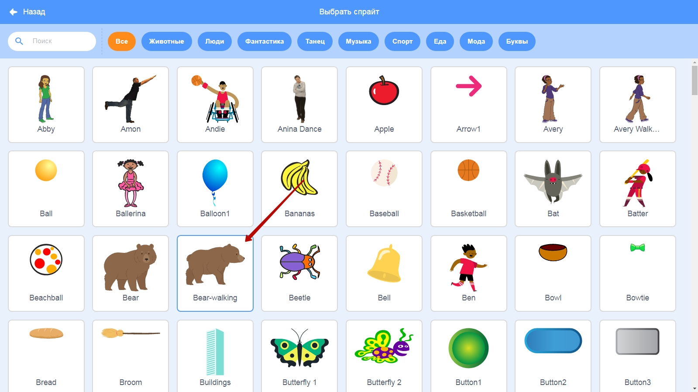  

Добавим медведю код, аналогичный тому, который мы добавляли котику

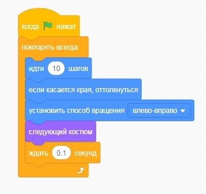  

Запустим котика и медведя в движение

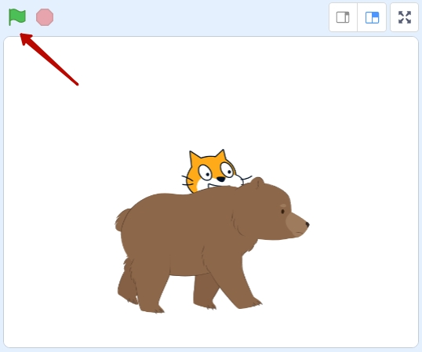  

Увидим как наш котик и медведь ходят на белом фоне.  

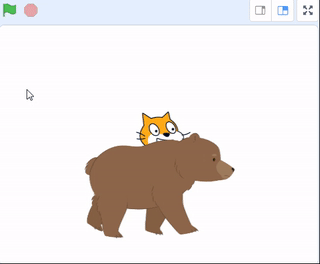  

## Добавление фона.
На данный момент наши персонажи гуляют на белом фоне. Добавим им тематический фон. Для этого зайдем в блок добавление фона.
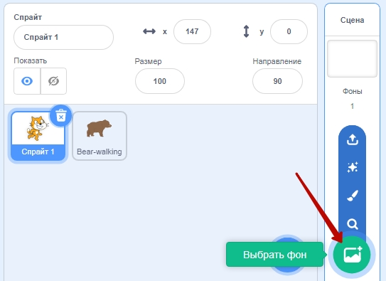  
Выберем фон forest (лес).  
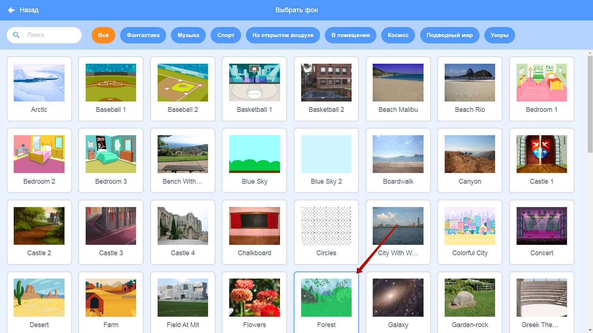  
Запустим прогулку котика и медведя по лесу  
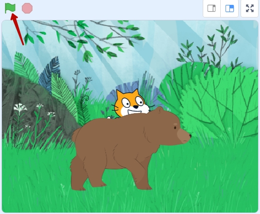  
Мы получим такую прогулку:  
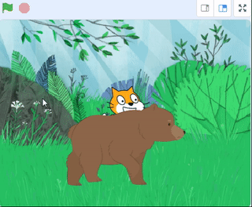  

## Дополнительные задания.

1. Добавьте 1-2 собственных персонажей.
2. Выберите собственный фон.
3. Запустите одновременную прогулку добавленных персонажей на выбранном фоне.

