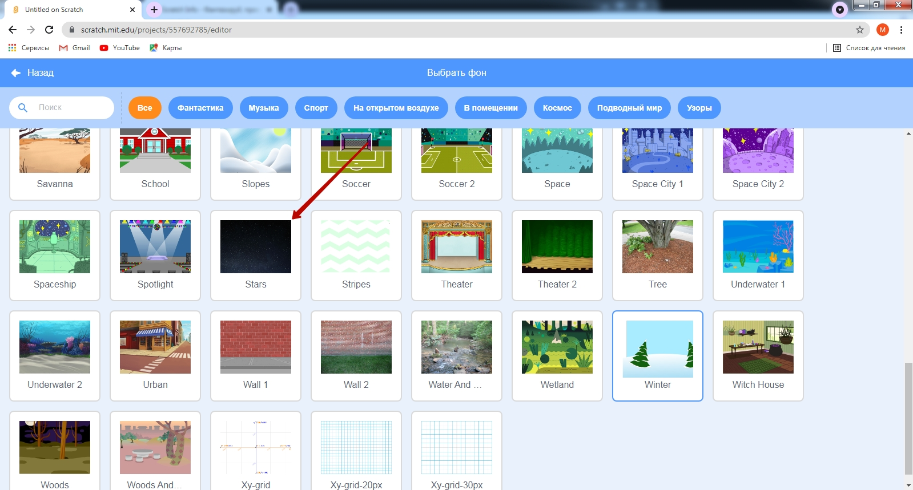

# Движение по точкам
В данном уроке мы с Вами разберем "движение по точкам" - перемещение персонажа по фону. При этом точки перемещения отмечает пользователь: редактор Scratch так устроен, что сохраняет точки, по которым перемещается персонаж. Данный навык позволяет создавать истории перемещения персонажей. При этом, если в данном занятии используется только стандартные фоны и спрайты, то в перспективе можно загружать собственный фоны и спрайты.
## Прогулка котика по замку.  
_Видео_.  

 
Создадим новый проект.  
  
  
  

Перейдем в раздел добавления фонов. 
  
И выберем фон **castle3**. 
  

Переместим персонажа в точку, из которой он будет выходить:  
  
Установим направление персонажа:  
  
По-умолчанию персонаж перевернется вверх ноками. Для того, чтобы его выровнять установим в настройках "способ вращения влево-вправо"

## Запуск программы. 
Установим событие запуска программы (пункт меню "Событие", команда "когда зеленый флаг нажат").  
  
Зафиксируем точку, с которой будет стартовать наш персонаж (команда "перейти в x:   y:). Данная команда фиксирует координаты, в которых на данный момент находится персонаж (в примере x:204 y:6).  
  
Перенесем персонажа в следующую точку.  
  
Добавим блок "Плыть 1 секунд в точку x:   y:  " (в примере х:119, y:-16). Данный блок перемещает персонажа из текущей точку в заданную за 1 секунду.
  
Проделаем аналогичные действия (перемещамем персонажа и добавляем блок "Плыть 1 секунд в точку x:   y:  ")
  
  
  
  
  
  
  
  
  
  
  
  
  
В данной точке персонаж должен повернуться в другую сторону (добавим блок "Повернуться в направлении 90")
  
Продолжим движение котика, чтобы он дошел до верхней точки на лестнице.    
  
  Запустим выполнение программы
  
  При запуске программы мы видим, что итоговое направление персонажа отличается от стартового. Поэтому добавим под командой "Перейти в x:  y:" команду "Повернуться в направлении -90" 
  
  Написанные программы в Scratch - сохраняются автоматически. Для того, чтобы вы не запустались в дальнейшем - называйте ваши программы. 
  _Сохранение с именем Forest_ 
  
    

  
  
  
  При сохранении программ вам необходимо будет подтердить адрес электронной почты, для того, чтобы ваша учетная запись имела полную функциональность
  
  
  
  
  
  
  
  
  
  
  
  
  
  
Для того, чтобы вы легко могли найти свои проекты в каталоге - задавайте им названия, которые соответствуют теме.
  
  
  
  
  
  
## Движение по точкам. Космос.

  
  
  
  
  
  
  
  
  
  
  
  
  
  
  
  
  
  
  
  
  
  
  
  
  
  
  
  
  
  
  
  
  
  
  
  
  
  
  
  
  
  
  
  
  
  
  
  
  
  
  
  
  
