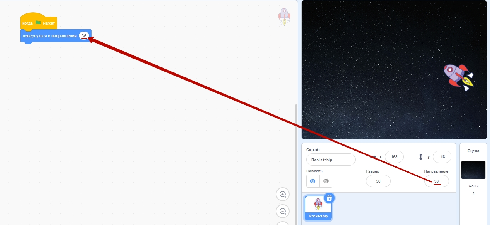
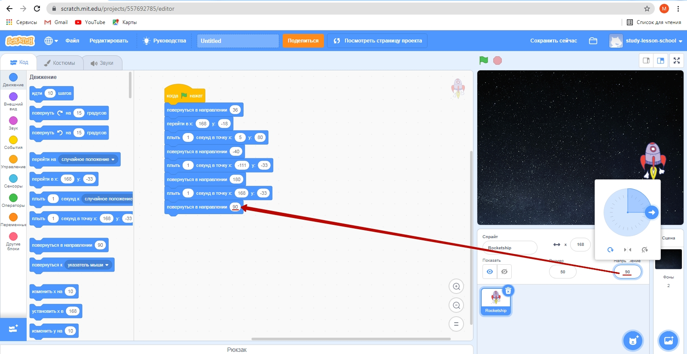

# Движение по точкам
В данном уроке мы с Вами разберем "движение по точкам" - перемещение персонажа по фону. При этом точки перемещения отмечает пользователь: редактор Scratch так устроен, что сохраняет точки, по которым перемещается персонаж. Данный навык позволяет создавать истории перемещения персонажей. При этом, если в данном занятии используется только стандартные фоны и спрайты, то в перспективе можно загружать собственный фоны и спрайты.
## Прогулка котика по замку.  
_Видео_.  

 
Создадим новый проект.  
  
  
  

Перейдем в раздел добавления фонов. 
  
И выберем фон **castle3**. 
  

Переместим персонажа в точку, из которой он будет выходить:  
  
Установим направление персонажа:  
  
По-умолчанию персонаж перевернется вверх ноками. Для того, чтобы его выровнять установим в настройках "способ вращения влево-вправо"

## Запуск программы. 
Установим событие запуска программы (пункт меню "Событие", команда "когда зеленый флаг нажат").  
  
Зафиксируем точку, с которой будет стартовать наш персонаж (команда "перейти в x:   y:). Данная команда фиксирует координаты, в которых на данный момент находится персонаж (в примере x:204 y:6).  
  
Перенесем персонажа в следующую точку.  
  
Добавим блок "Плыть 1 секунд в точку x:   y:  " (в примере х:119, y:-16). Данный блок перемещает персонажа из текущей точку в заданную за 1 секунду.
  
Проделаем аналогичные действия (перемещамем персонажа и добавляем блок "Плыть 1 секунд в точку x:   y:  ")
  
  
  
  
  
  
  
  
  
  
  
  
  
В данной точке персонаж должен повернуться в другую сторону (добавим блок "Повернуться в направлении 90")
  
Продолжим движение котика, чтобы он дошел до верхней точки на лестнице.    
  
  Запустим выполнение программы
  
  При запуске программы мы видим, что итоговое направление персонажа отличается от стартового. Поэтому добавим под командой "Перейти в x:  y:" команду "Повернуться в направлении -90" 
  
  Написанные программы в Scratch - сохраняются автоматически. Для того, чтобы вы не запустались в дальнейшем - называйте ваши программы. 
  _Сохранение с именем Forest_ 
  
    

  
  
  
  При сохранении программ вам необходимо будет подтердить адрес электронной почты, для того, чтобы ваша учетная запись имела полную функциональность
  
  
  
  
  
  
  
  
  
  
  
  
  
  
Для того, чтобы вы легко могли найти свои проекты в каталоге - задавайте им названия, которые соответствуют теме.
  
  
  
  Для создания нового проекта зайдите в меню "Файл" и выберите "Новый"
  
  
## Движение по точкам. Космос.

В данном проекте мы создадим анимационную историю в которой ракета летает в космосе (на фоне звездного нема).
Для подбора подходящего фона зайдем в каталог фонов. 
  
  Пролистаем список фонов с помощью полосы прокрутки.
  
  Выберем фон под названием "Stars"
  
  Выберем подбора подходящего персонажа зайдем в каталог персонажей.
  
  Пролистаем предлагаемые персонажи с помощью полосы прокрутки. 
  
  Выберем персонажа - космический корабль (Rocketship)
  
  Удалим персонажа, который выставляется по-умолчанию.
  
  А для персонажа-ракеты установим размер 50.
  
  Переместим персонажа в точку, с которой он будет начинать движение в нашем проекте.
  
  И установим положение (повернем на 36 градусов).
  
  Зададим событие начала программы (команда "Когда зеленый флаг нажат")
  
  Зададим команду "Повернуться в направлении 36" (значение в данной команде соответствует тому направлению, которое мы подобрали для нашего персонажа вручную).
  
  Добавим команду "Перейти в x:  y:" которая соответствует начальной точке движения персонажа.
  

Теперь при запуске программы (нажатии на зеленый флажок) наш персонаж (ракета) будет перемещаться в начальную точку (x:168  y:-18).  

_Запуск программы._

Переместим ракету в направлении движения. 
  
  
  Добавим блок "Плыть 1 секунд в точку x:  y: " (x:5  y:80).  
  
  Зададим новое направление движение ракеты (-40)
  
  Добавим блок "Повернуться в направлении", значение которого будет соответствовать подобранному направлению.
  
  Еще раз передвинем ракету - в новую точку
  
  Также - повернем ее. Данное направление для примера взято 180 градусов (ракета летит горизонтально).
  
  В этом перемещении ракету передвигаем не мышкой, а задаем значение по координате x такое же, как у стартовой позиции (мы делаем это, чтобы, в итоге, замкнуть траекторию)
  
  Установим новое направление (90), которое соответствует направлению персонажа вертикально вверх.
  
  Добавим команду "Плыть 1 секунд в точку x:  y: " с координатами, которые соответсвуют начальной точки движения нашей ракеты (x:168  y:-18).
  
  Теперь наша ракета летает по замкнутой траектории.
_  Анимация - полет ракеты по замкнутой траектории._
  Повторение движения ракеты по определенной нами замкнутой траектории можно задавать не только с помощью многократного нажатия на "Зеленый флаг", но и с помощью команды "Повторить 10 раз" из пункта меню "Управление"
  
  Запустим написанную программу:
  
  
  
  
  
  Для того, чтобы в будущем не потерять проект зададим ему название **Space**
  
